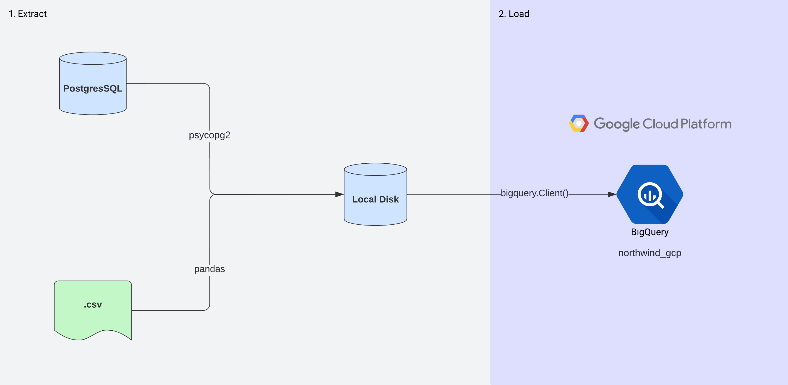
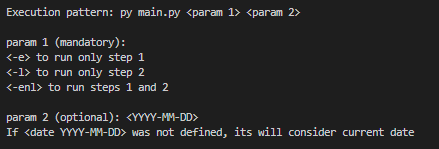
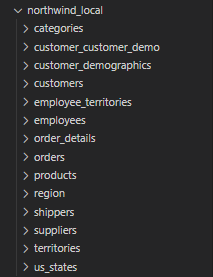

# code-challenge Breno Milagres
Indicium code challenge for Software Developer focusing on data projects


# Flowchart


## Dashboard DataStudio - Plus =)
Final query scheduled in Data Studio
Dash with link:

link: https://datastudio.google.com/reporting/96c3d5b2-cc13-41f5-8d7c-c9a784a6c232


## Chosen database 

Step 2 will be performed by extracting the data from the local disk and uploading it to Bigquery (datawarehouse hosted by Google Cloud). 


To connect and authenticate uploads in Bigquery, a service account with write permissions was created and from this service account an access key was generated that inherits these permissions.


With the client libraries and the access key, you can instantiate a bigquery.Client() class and thus perform read and write operations.

link to documentation:
> https://cloud.google.com/bigquery/docs/quickstarts/quickstart-client-libraries?hl=pt-br#client-libraries-install-python

## Install packages 
```
pip install -r ./requirements.txt
```

## Instructions on how to run the  pipeline
- Execution pattern: 
    
    ```
    py main.py <Parameter 1> <Parameter 2>
    ```
    - **Parameter 1** (mandatory):
        - **-e**: to run only step 1 
        - **-l**: to run only step 2 
        - **-enl**: to run steps 1 and 2
    - **Parameter 2** (optional):
        - date in format **YYYY-MM-DD**
        - If date was not defined, its will consider current date

- Examples: 

        py main.py -e 2022-01-01 

        py main.py -l 2022-02-01

        py main.py -enl

- If no parameter or a wrong parameter is passed, a help message will be printed:



## Requirements

- All tasks should be idempotent, you should be able the whole pipeline for a day and the result should be always the same
    - **R:** Se o pipeline for executado com os mesmos parâmetros de data o dados serão truncados e o resultado será  o mesmo.
- Step 2 depends on both tasks of step 1, so you should not be able to run step 2 for a day if the tasks from step 1 did not succeed
    - **R:** Se o pipeline for executado com o parâmetro 2 = `-l` para uma data que ainda não foi extraída uma mensagem de erro será printada:
    
    
- You should extract all the tables from the source database, it does not matter that you will not use most of them for the final step.
    - **R:** através de um laço for e as funções do script `utils_etl.extract.py` pode-se conectar ao banco pgSQL e efetuar todas as consultas.

    
- You should be able to tell where the pipeline failed clearly, so you know from which step you should rerun the pipeline
    - **R:** Foram adicionados checkpoints para que seja possível acompanhar a execução do pipeline, além de verificações de erro após os métodos para fácil indentificação de problemas.
- You have to provide clear instructions on how to run the whole pipeline. The easier the better.
    - **R:** A isntruções estão presentes em uma das seções acima.
- You have to provide a csv or json file with the result of the final query at the final database.
    - **R:**
    ```sql
    SELECT 
        * 
    FROM 
        northwind_gcp.orders ord
        JOIN northwind_gcp.order_details ord_dt 
            ON ord.order_id = ord_dt.order_id
    ```
    caminho do csv: ./bquery_results_final_qry.csv
- You dont have to actually schedule the pipeline, but you should assume that it will run for different days.
    - **R:** pipe modelado para ser agendado.
- Your pipeline should be prepared to run for past days, meaning you should be able to pass an argument to the pipeline with a day from the past, and it should reprocess the data for that day. Since the data for this challenge is static, the only difference for each day of execution will be the output paths.
    - **R:** É possível passar o parâmetro 2 para datas.
    
# The Challenge

We are going to provide 2 data sources, a Postgres database and a CSV file.

The CSV file represents details of orders from a ecommerce system.

The database provided is a sample database provided by microsoft for education purposes called northwind, the only difference is that the order_detail table does not exists in this database you are beeing provided with.This order_details table is represented by the CSV file we provide.

Schema of the original Northwind Database: 


Your mission is to build a pipeline that extracts the data everyday from both sources and write the data first to local disk, and second to a database of your choice. For this challenge, the CSV file and the database will be static, but in any real world project, both data sources would be changing constantly.


Its important that all writing steps are isolated from each other, you shoud be able to run any step without executing the others.

For the first step, where you write data to local disk, you should write one file for each table and one file for the input CSV file. This pipeline will run everyday, so there should be a separation in the file paths you will create for each source(CSV or Postgres), table and execution day combination, e.g.:

```
/data/postgres/{table}/2021-01-01/file.format
/data/postgres/{table}/2021-01-02/file.format
/data/csv/2021-01-02/file.format
```

you are free to chose the naming and the format of the file you are going to save.

At step 2, you should load the data from the local filesystem to the final database that you chosed. 

The final goal is to be able to run a query that shows the orders and its details. The Orders are placed in a table called **orders** at the postgres Northwind database. The details are placed at the csv file provided, and each line has an **order_id** field pointing the **orders** table.

How you are going to build this query will heavily depend on which database you choose and how you will load the data this database.

The pipeline will look something like this:


## Things that Matters

- Clean and organized code.
- Good decisions at which step (which database, which file format..) and good arguments to back those decisions up.

## Setup of the source database

The source database can be set up using docker compose.
You can install following the instructions at 
https://docs.docker.com/compose/install/

With docker compose installed simply run

```
docker-compose up
```

You can find the credentials at the docker-compose.yml file

## Final Instruction

You can use any language you like, but keep in mind that we will have to run your pipeline, so choosing some languague or tooling that requires a complex environment might not be a good idea.
You are free to use opensource libs and frameworks, but also keep in mind that **you have to write code**. Point and click tools are not allowed.

Thank you for participating!
